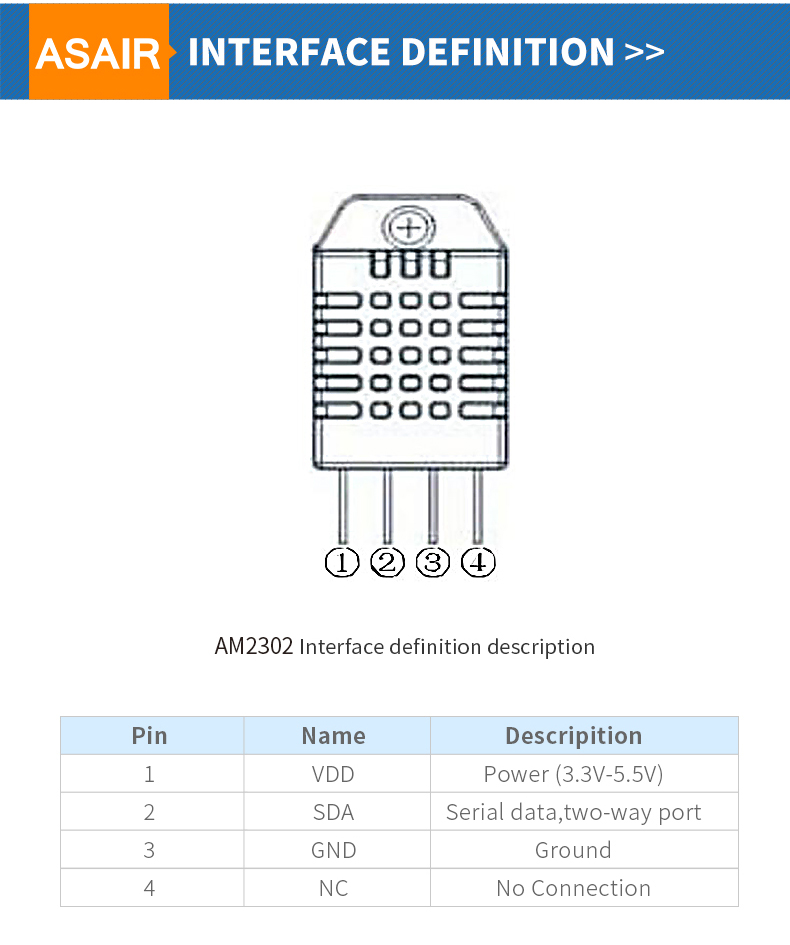

# humidity-temperature-sensor

A raspberry pi 0 2 w humidity and temperature sensor

- Raspberry Pi 0 2 W
- HiLetgo DHT22/AM23 (ASAIR AM2302)
- [Raspberry Pi Tutorial: How to Use the DHT-22](https://www.instructables.com/Raspberry-Pi-Tutorial-How-to-Use-the-DHT-22/)
- [onoff](https://github.com/fivdi/onoff)

## pi setup

Installing the OS:

1. install imager
1. select the Raspberry Pi OS (64-bit) image
1. click edit settings
    1. set hostname, username, password, WLAN, locale, and enable the SSH service

Connecting the sensor:

1. connect the left pin (i.e. +) to pin 1 for 3,3V of power
1. connect the middle pin (i.e. out) to pin 3 for data
1. connect the right pin (i.e. -) to pin 6 for ground

## raspberry pi 0 2 spec

## sensor spec

